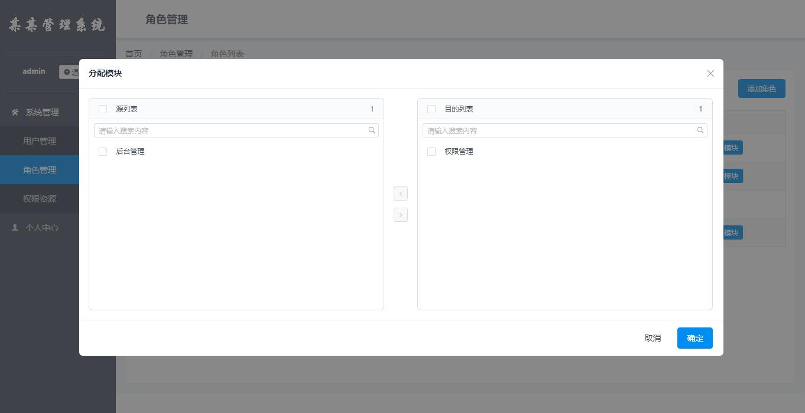

### 概述

本程序使用的技术为laravel与vue，rbac部分使用`PHPZen\LaravelRbac`包

### 效果展示

### 部署步骤

1. 将database/db_init.sql导入到本地数据库
2. 配置`.env`文件中的相关参数
3. 安装npm包，首先`npm install -g yarn'，然后`yarn install`
4. 安装composer包，执行`composer update`
5. 配置apache或nginx虚拟主机到/public目录下，比如域名为：demo.example.com
6. 使用cmd进入到根目录，执行`npm run start`

执行完以上步骤后，打开浏览器访问：http://demo.example.com即可看到项目
